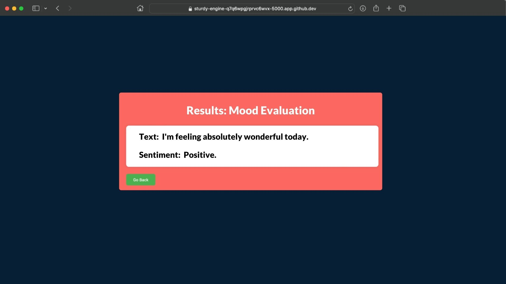

# Auto Scaling Flask App Using Azure App Services

## Model

This application utilizes a sentiment analysis model built upon Hugging Face's pre-trained transformer models, specifically crafted for natural language processing tasks. Employing transfer learning on an extensive dataset, the model predicts the sentiment of textual data.

## Integration Details

Within the Flask application, the model is instantiated using Hugging Face's pipeline module. Upon receiving text input from the user, the model processes the text, predicts the sentiment, and subsequently delivers the result back to the user.

The relevant code snippets in `app.py` demonstrate how the model is loaded and used for sentiment analysis.

### Model Customization

While employing a pre-trained sentiment analysis model, this application provides users with the flexibility to explore a range of pre-trained models offered by Hugging Face for diverse natural language processing tasks. Users can select and customize models according to their specific needs by adjusting the model loading code in app.py.

### Working of the app

## Deploying Flask App to Docker Hub

#### Build the Docker image:
    - docker build -t my-flask-app .

#### Run the Docker container locally:
    - docker run -p 5000:5000 my-flask-app

### Deploying to Docker Hub
    - docker login
    - docker tag my-flask-app username/my-flask-app:latest
    - docker push username/my-flask-app:latest

## Prerequisites

      - [Azure CLI](https://docs.microsoft.com/en-us/cli/azure/install-azure-cli) 

## Steps

### 2. Configure Flask App

      - pip install flask transformers

### 3. Azure Login

      - az login

### 4. Deploy to Azure App Service

      - az webapp up --sku F1 --name <YOUR_APP_NAME> --location <YOUR_REGION>

Replace <YOUR_APP_NAME> with your app name and <YOUR_REGION> with your desired Azure region.

### 5. Access Your Web App

      - https://<YOUR_APP_NAME>.azurewebsites.net

## HTML Templates

The Flask web application uses HTML templates for the user interface. Two main templates are used:

### `index.html`

This HTML file serves as the main user interface for inputting text for sentiment analysis. It contains:

- Text area for user input.
- Form submission for analysis.
- Basic styling elements.

Modify `index.html` to adjust the layout, add more input fields, or enhance the user experience based on your application's requirements.

### `result.html`

The `result.html` template is used to display the sentiment analysis result. It includes:

- Display area for the analyzed text.
- Section to show the sentiment analysis result.

These HTML templates are used in conjunction with the Flask routes in `app.py` to render the user interface and display analysis results to the end-user.
       
